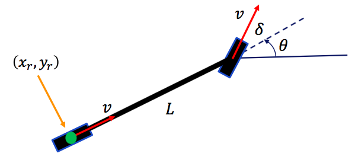

# Kinematic Bicycle Model
[](https://lgtm.com/projects/g/winstxnhdw/KinematicBicycleModel/alerts/)
[](https://lgtm.com/projects/g/winstxnhdw/KinematicBicycleModel/context:python)
<div align="center">
	
</div>
   
## Abstract
A python library for the Kinematic Bicycle model.

```yaml
:param x:           (float) vehicle's x-coordinate [m]
:param y:           (float) vehicle's y-coordinate [m]
:param yaw:         (float) vehicle's heading [rad]
:param v:           (float) vehicle's velocity in the x-axis [m/s]
:param throttle:    (float) vehicle's forward speed [m/s]
:param delta:       (float) vehicle's steering angle [rad]
:param L:           (float) vehicle's wheelbase [m]
:param max_steer:   (float) vehicle's steering limits [rad]
:param c_r:         (float) vehicle's aerodynamic coefficient
:param c_a:         (float) vehicle's coefficient of resistance
:param dt:          (float) discrete time period [s]

:return x:          (float) vehicle's x-coordinate [m]
:return y:          (float) vehicle's y-coordinate [m]
:return yaw:        (float) vehicle's heading [rad]
:return v:          (float) vehicle's velocity in the x-axis [m/s]
:return delta:      (float) vehicle's steering angle [rad]
:return omega:      (float) vehicle's angular velocity [rad/s]
```

## Requirements
```bash
# Install NumPy
$ pip install numpy
```

## Usage (for Animation)
This animation is inspired by Atsushi Sakai.
```bash
# Install requirements.txt
$ pip install -r requirements.txt

# Play the animation
$ python animation.py
```

## Concept
<div align="center">
	
</div>
